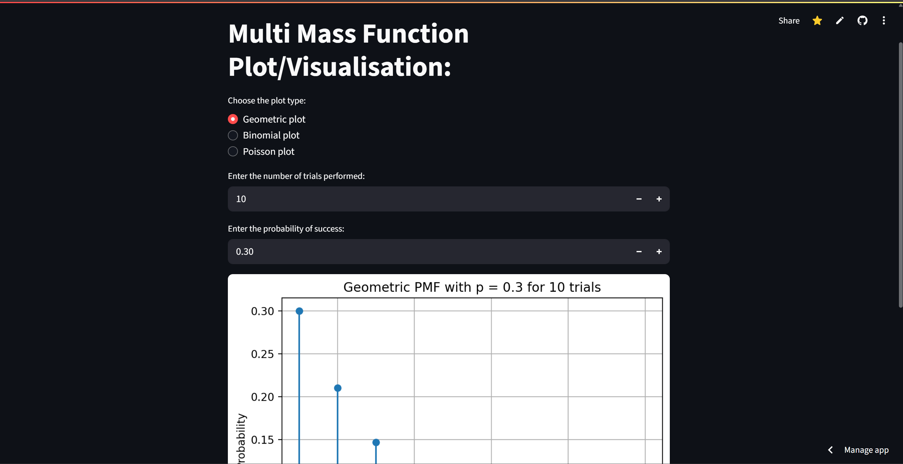

# Multi Probability Mass Function Plotter
---
## Preview:

---
## What is it?
- A Streamlit app that plots any one of various probability mass functions based on the user's inputs for parameters.
- Uses scipy.stats libraries to produce probability mass functions.
---
## How does it work?
- Provides a radio button for the choice of Distribution you'd like.
- Then takes user inputs for the number of trials to be performed (upto 100).
- Also collects the probability of success (between 0 and 1) or the Lambda value for Poisson plots.
- Produces the pmf and plots the distribution for the given range of inputs.
---
## How do I view it?
__There are 2 main ways to do so__
1. ### Clone the repo and view it locally:
   - First clone the repository like so:
     ```bash
     git clone https://github.com/omynayak/probability-distribution-plot.git
     ```
   - Then open the terminal on your machine and navigate to the directory that app.py is in:
     ```bash
     cd filepath/to/directory/containing/app.py
     ```
   - Finally run the streamlit app using the command:
     ```bash
     streamlit run app.py
     ```
2. ### View it online
   As the app is already hosted on Streamlit, you can directly view it [here](https://probability-distribution-plot-sfu4congy4uq3wzhrsappus.streamlit.app/).
